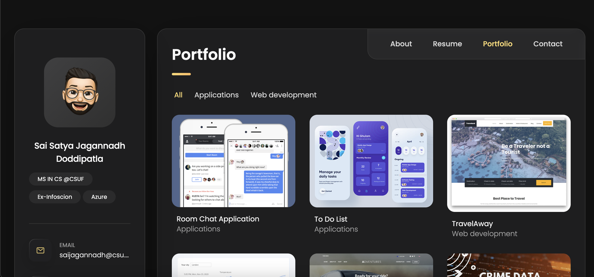

## Demo




## Prerequisites

Before you begin, ensure you have met the following requirements:

* [Git](https://git-scm.com/downloads "Download Git") must be installed on your operating system.

## Installing vCard

To install **Portfolio**, follow these steps:

Linux and macOS:

```bash
sudo git clone hhttps://github.com/SaiSatyaJagannadh/PersonalPortfolio.git
```


Windows:

```bash
sudo git clone https://github.com/SaiSatyaJagannadh/PersonalPortfolio.git
```
## Reference links

https://github.com/serranopuente/serranopuente.github.io


## Contact

If you want to contact me you can reach me at "saijagannadh1999@gmail.com".

## License

MIT
